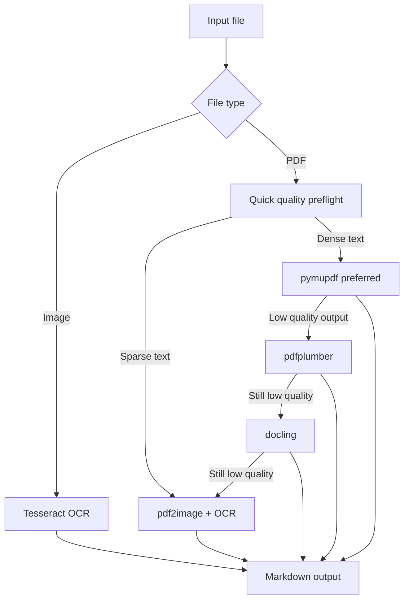

# Text Extractor

[](https://pypi.org/project/text-extractor-lightweight/)
[](https://pypi.org/project/text-extractor-lightweight/)
[](LICENSE)

Production-ready text extraction for PDFs and images with a quality-aware fallback pipeline.

Built for agent workflows first: one package gives you a CLI, Python API, and MCP server.

## Why this project

Most extractors are good at one thing: either fast digital PDFs, or OCR-heavy scans. This project does both by routing each file through the right backend and escalating only when quality drops.

### Core strengths

- Fast path for dense digital PDFs
- Automatic fallback for low-quality/garbled text
- OCR path for scanned PDFs and images
- MCP tools for VS Code, Claude, and other MCP clients
- Clean markdown output suitable for LLM context ingestion

## Install

```bash
pip install text-extractor-lightweight
```

Optional extras:

```bash
# Preferred backend for fast and robust PDF text extraction
pip install "text-extractor-lightweight[fast]"

# OCR support (images + scanned PDFs)
pip install "text-extractor-lightweight[ocr]"

# Advanced layout fallback
pip install "text-extractor-lightweight[docling]"

# Everything
pip install "text-extractor-lightweight[all]"
```

OCR system dependencies:

- Tesseract OCR: https://github.com/tesseract-ocr/tesseract
- Poppler tools (`pdftoppm`) for PDF-to-image conversion

Windows setup:

```powershell
winget install --id tesseract-ocr.tesseract -e
winget install --id oschwartz10612.Poppler -e
```

## 30-second quickstart

```bash
# Full file extraction
text-extractor ./docs/report.pdf

# Page-range extraction
text-extractor ./docs/report.pdf --pages 2-6

# Metadata and extraction diagnostics
text-extractor ./docs/report.pdf --info

# Show routing decision only
text-extractor ./docs/report.pdf --strategy
```

## Architecture



## MCP server

Run directly:

```bash
uvx --from text-extractor-lightweight text-extractor-mcp
```

VS Code MCP config (`.vscode/mcp.json`):

```json
{
  "servers": {
    "text-extractor": {
      "command": "uvx",
      "args": ["--from", "text-extractor-lightweight", "text-extractor-mcp"]
    }
  }
}
```

Claude Code:

```bash
claude mcp add text-extractor -- uvx --from text-extractor-lightweight text-extractor-mcp
```

Exposed tools:

- `extract_text_from_file`: Extract full text from PDF/image to markdown
- `extract_text_pages`: Extract a page range from PDF
- `get_document_info`: Return metadata, quality score, token estimate

## Python API

```python
from text_extractor.extract import extract_text, extract_raw

markdown = extract_text("report.pdf")
print(markdown[:500])

result = extract_raw("report.pdf")
print(result.backend_used, result.total_pages, result.estimated_tokens)
```

## Showcase project

This repository now includes a runnable showcase pipeline in `examples/showcase_pipeline.py`.

It demonstrates how to:

- Detect strategy before extraction
- Extract and score text quality
- Save markdown output and machine-readable report JSON

Run it:

```bash
python examples/showcase_pipeline.py /absolute/path/to/document.pdf
```

Custom output directory:

```bash
python examples/showcase_pipeline.py /absolute/path/to/document.pdf --out showcase-output
```

## Troubleshooting

- If `text-extractor` is not found, ensure your Python Scripts directory is on PATH.
- For MCP stdio mode, only an MCP client should communicate with the server stdin/stdout.
- If OCR never triggers for scanned docs, verify Tesseract and Poppler are installed and discoverable.

## Release

```bash
py -m build
py -m twine check dist/*
py -m twine upload --repository testpypi dist/*
py -m twine upload dist/*
```

For full release steps, see `RELEASE_CHECKLIST.md`.

## License

MIT
